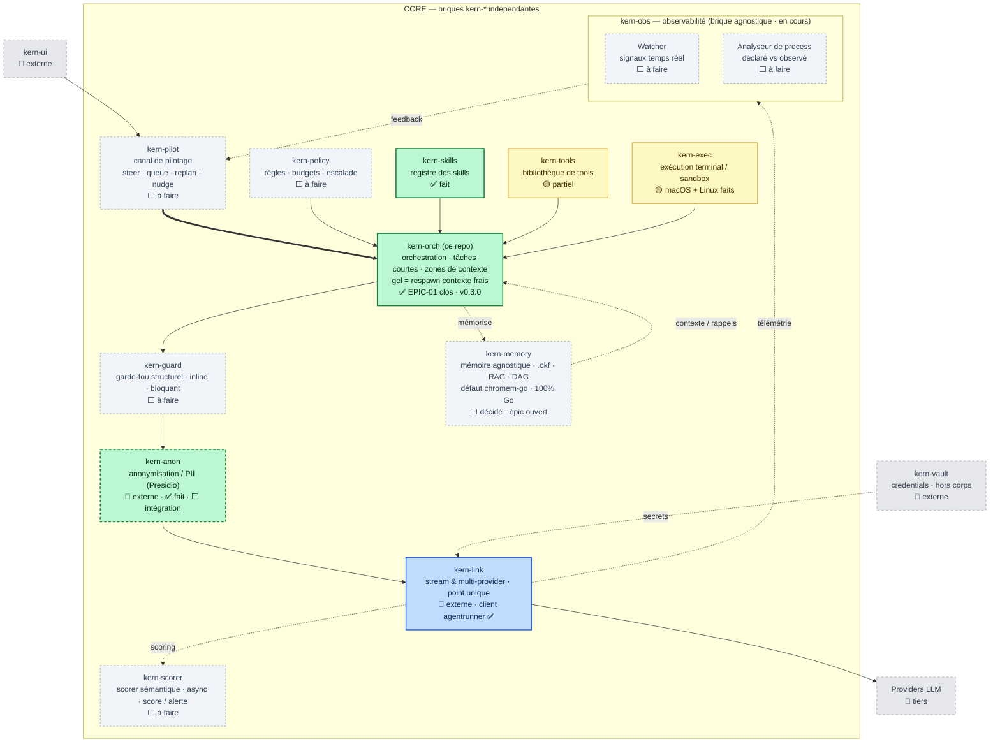

# Kern-Orch — Cartographie & épics par module

> Situe **Kern-Orch** (ce repo) dans l'écosystème cible « Kern » et détaille le travail
> restant, module par module, pour s'organiser. Dernière mise à jour : 2026-07-23.

## Principe : des briques autonomes et agnostiques

Chaque boîte de la carte est une **brique `kern-*` autonome et agnostique** — un module à part
entière (repo/déployable propre), composable via des **contrats standards**, jamais du code
enfoui dans une autre brique. Une brique ne dépend pas des internes d'une autre : elles se
parlent par des frontières neutres (subprocess/JSON-lines pour kern-link, OTLP/GenAI pour
kern-obs, etc.).

La famille (noms) :

| Brique | Rôle | Statut |
|---|---|---|
| **kern-orch** | orchestration (ce repo) | ✅ moteur · EPIC-01 clos (v0.3.0) |
| **kern-memory** | mémoire agnostique (.okf · RAG · DAG) | ⬜ décidé (brainstorm) · épic ouvert |
| **kern-anon** | anonymisation / PII (Presidio) | 🔌 externe · faite |
| **kern-link** | passage LLM multi-provider (point unique) | 🔌 externe · client fait |
| **kern-obs** | observabilité agnostique | ⬜ module à part · en cours |
| **kern-skills** | registre des skills (SKILL.md) | ✅ *(sous-package de kern-orch, extractible)* |
| **kern-tools** | bibliothèque de tools | 🟡 *(sous-package de kern-orch, extractible)* |
| **kern-pilot** | canal de pilotage (steer · queue · replan · nudge) | ⬜ |
| **kern-policy** | policies & permissions (règles · budgets · escalade) | ⬜ |
| **kern-guard** | garde-fou structurel (inline · bloquant) | ⬜ |
| **kern-exec** | exécution terminal / sandbox | 🟡 *(macOS + Linux faits, Windows refuse explicitement ; réseau encore tout-ou-rien)* |
| **kern-scorer** | scorer sémantique (async · score / alerte) | ⬜ |
| **kern-vault** | credentials vault | 🔌 externe |

## Où se situe ce repo

**kern-orch** est la brique **Orchestration** du CORE, plus ce qu'elle porte directement
(**kern-skills**, **kern-tools**, et le *client* de kern-link) — aujourd'hui sous-packages de
ce repo, extractibles en briques propres plus tard. Les autres briques `kern-*` sont des
modules séparés : certaines déjà faites (kern-anon, kern-link) à **câbler** par contrat, les
autres à créer. **kern-orch ne dépend d'aucune** ; il expose/consomme des contrats.

**Légende de statut**
- ✅ **fait** — présent et testé dans ce repo
- 🟡 **partiel** — amorcé, incomplet
- ⬜ **à faire** — pas commencé
- 🔌 **externe** — brique `kern-*` séparée / dépendance (hors de ce repo)

## Cartographie (mermaid)

---

## Épics par module

Chaque module = un épic. Taille indicative : **S** (~jours), **M** (~1–2 semaines),
**L** (~3 semaines +). Les dépendances pointent vers ce qui doit exister avant.

### ✅ EPIC-01 · kern-orch — Orchestration (moteur) — *ce repo, CLOS — v0.3.0*
Rôle : possède le graphe, le state, le routage, les checkpoints. Cœur agnostique métier.
- [x] State partagé sérialisable, Node (tool/agent/subgraph), edges Go-purs, fan-out
- [x] Checkpoints SQLite + reprise (`resume`)
- [x] Sous-graphes / sous-agents
- [x] **Zones de contexte & « gel = respawn contexte frais »** — `State` à zones (persistant/éphémère),
  `Freeze(carry)` respawn un contexte frais (compteur `Frozen`), exposé en tool builtin `freeze`
  (`examples/freeze.yaml`). Fiche okf-0009. *(livré)*
- [x] Persistance du chemin YAML dans le checkpoint → `resume <run-id>` sans re-fournir le graphe.
  Fiche okf-0008. *(livré)*
- Dépendances : aucune.
- **Clôture** : merge dev→main, tag **v0.3.0** (2026-07-22). Tout vert sous `go test -race`, E2E binaire.

### ✅ EPIC-02 · kern-skills — registre des skills — *fait (sous-package de kern-orch)*
Rôle : catalogue des capacités (SKILL.md, `type: tool|agent`).
- [x] Load frontmatter, `list-skills`
- [ ] Lien registre ↔ exécution : qu'un `type: tool` soit **exécutable** sans redéclarer une func Go par nom (fusionner catalogue et `topology.Registry`). **M** — *voir EPIC-03*
- Dépendances : aucune.

### 🟡 EPIC-03 · kern-tools — bibliothèque de tools — *partiel (sous-package de kern-orch)*
Rôle : bibliothèque de tools invoqués par un agent, consommés aussi par l'UI/MCP/API.
- [x] `topology.Registry` (funcs tool/router par nom) + builtins de démo
- [x] Mode démon (`kern-orch serve`) — un service qui tourne, plutôt qu'une commande qu'on
      lance. Prérequis de l'exposition, pas l'exposition elle-même : les runs se pilotent
      par HTTP (`POST /api/v1/runs`, statut immédiat, reprise), mais aucun tool n'est encore
      lisible ni invocable depuis l'extérieur. *(2026-07-28)*
- [ ] Format de tool réutilisable (schéma d'entrée/sortie, validation) **M**
- [ ] Chargement de tools depuis les skills (`type: tool`) **M**
- [ ] Exposition MCP/API des tools (un service unique, zéro duplication) **L** — reste à
      faire ; c'est elle qui débloquerait C5 côté kern-ui.
- Dépendances : EPIC-02.

### 🟡 EPIC-04 · kern-exec — exécution terminal / sandbox
Rôle : exécuter des tools/commandes dans un bac à sable (isolation, timeouts, quotas).
- [x] Runner sandboxé (process isolé, cwd/env contrôlés, timeout) — macOS (Seatbelt) et
  Linux (landlock + espace de noms réseau) faits et vérifiés en vrai ; Windows refuse
  explicitement (personne n'a de machine pour vérifier). **M**
- [ ] Liste d'autorisation réseau par IP/CIDR (`--allow-connect`) — planifiée 2026-07-31,
  inspirée du modèle `allowOut`/`denyOut` de kvcache-ai/AgentENV (repo étudié pour
  l'inspiration, hors de propos par l'échelle — voir `kern-exec/CLAUDE.md`, section
  « Portée réseau »). Reste un mécanisme de confinement que kern-exec applique, pas une
  politique qu'il décide — `kern-policy` reste le décideur le jour où elle existe. **M**
- [ ] Intégration comme type de nœud/tool **S**
- Dépendances : EPIC-03, EPIC-06 (policies).

### ⬜ EPIC-05 · kern-pilot — canal de pilotage (steering)
Rôle : piloter un run en cours — `steer · queue · replan · nudge` (human/agent-in-the-loop).
- [ ] Boucle de contrôle : file d'instructions injectables dans un run vivant **L**
- [ ] `replan` (réécrire la frontière/graphe en cours) + `nudge` **L**
- [ ] Reçoit le feedback de l'observation (flèche retour de la carte) **M**
- Dépendances : EPIC-01, EPIC-11 (observation).

### ⬜ EPIC-06 · kern-policy — policies & permissions
Rôle : règles, budgets, escalade — **sans secrets** (les secrets = vault externe).
- [ ] Modèle de règles (qui peut quel tool/skill, budgets de tokens/temps) **M**
- [ ] Point d'application avant orchestration (la flèche Policies → Orchestration) **M**
- [ ] Escalade / approbations **M**
- Dépendances : EPIC-01.
- Le jour où cette brique existe, la primitive réseau IP/CIDR de kern-exec (EPIC-04,
  `--allow-connect`) est le point d'application naturel pour une règle réseau qu'elle
  déciderait — kern-policy choisit la liste, kern-exec continue de ne faire que l'appliquer.

### ⬜ EPIC-07 · kern-guard — garde-fou structurel (inline, bloquant)
Rôle : validation **bloquante** en ligne entre Orchestration et données (schémas, invariants).
- [x] Embryon : `Graph.Validate` (topologie)
- [ ] Garde-fous runtime sur le state/sorties (schémas, contraintes métier), bloquants **M**
- Dépendances : EPIC-01.

**Scope étendu, décidé le 2026-07-29, pas encore cadré** : le modèle « cercle de Willis »
(`../cercle_de_willis.md`, à la racine de l'espace de travail) — score de tension par agent,
détection de dérive sémantique, shunt automatique vers un agent de secours, isolation
(« clamping ») d'un agent qui dérive — appartient ici, pas à kern-pilot (EPIC-05). Raison :
c'est une boucle interne à l'exécution du graphe (réflexe, sans aller-retour externe),
alors que kern-pilot est un chemin d'écriture externe authentifié (un humain, plus tard
peut-être un agent autorisé). Les deux partagent une primitive au niveau du moteur
(« isoler/rerouter un nœud »), déclenchée soit automatiquement ici, soit depuis l'extérieur
via C6 — à concevoir comme un chantier à part, après C6.

### 🔌 EPIC-08 · kern-anon (PII/Presidio) — *brique externe faite, intégration à faire*
Rôle : pseudonymisation par ID avant l'appel LLM ; ré-hydratation au retour. Brique `kern-*`
autonome et agnostique — kern-orch ne fait que la câbler par contrat.
- [x] 🔌 Brique de pseudonymisation (Presidio) — **externe, fonctionnelle**
- [ ] Définir le contrat d'intégration (I/O de la brique) **S**
- [ ] Câblage côté kern-orch : pseudonymiser à l'aller / ré-hydrater au retour, autour de
  kern-link (juste avant/après l'`agentrunner`) **M**
- Dépendances : EPIC-01 ; positionné juste avant kern-link ; accès à la brique kern-anon.

### 🔌 EPIC-09 · kern-link (client) — *externe, client fait*
Rôle : point de passage unique vers les providers (stream & multi-provider). La brique
elle-même est **externe** (repo du collègue).
- [x] Client subprocess (`agentrunner.Subprocess`) + Stub + protocole JSON-lines **provisoire**
- [ ] **Réconcilier le contrat §6.4** avec la vraie CLI dès accès **M** *(bloquant externe)*
- Dépendances : accès au repo kern-link.

### ⬜ EPIC-10 · kern-scorer — scorer sémantique (async)
Rôle : scorer les échanges (qualité/dérive) en asynchrone, émettre des alertes.
- [ ] Hook async sur kern-link (télémétrie) → score **M**
- [ ] Seuils & alertes **S**
- Dépendances : EPIC-09, EPIC-11.

### EPIC-11 · kern-obs — observabilité — deux moitiés distinctes
**Décision** : **OpenTelemetry (conventions GenAI)** comme frontière neutre ; **LangSmith écarté**
(propriétaire, non souverain, Python/JS-first, cher). → voir `brainstorming/OBSERVABILITY.md`. À séparer
strictement en deux :

**11a — côté kern-orch (émission, DANS ce repo) — S–M**
Fine couche : émettre, sans aucune dépendance vers kern-obs.
- [x] Embryon : checkpoints + `status`
- [ ] Span racine par run (trace = runID), span par nœud (hook `StepFunc`), span `gen_ai.*`
  par appel LLM (`agentrunner`) **S–M**
- [ ] Émettre le **plan déclaré** comme attributs de télémétrie (nœuds/edges attendus), pour
  que le « déclaré vs observé » reste faisable **sans** lire l'intérieur de kern-orch **S**
- [ ] Exporter OTLP pluggable via env (défaut off = no-op, comme le Stub) **S**
- Dépendances : EPIC-01 ; épingler une version des semconv GenAI (statut « Development »).

**11b — 🧱 kern-obs (brique autonome, HORS de ce repo) — module à part**
Agnostique : ingère l'OTLP/GenAI de **n'importe quelle** brique `kern-*`, pas seulement kern-orch.
- [ ] Ingestion OTLP + stockage (peut s'appuyer en interne sur Langfuse/Phoenix) **M**
- [ ] Watcher temps réel (flux de spans) **M**
- [ ] Analyseur « déclaré vs observé » (plan émis vs trace réelle) — **valeur ajoutée** **M–L**
- [ ] Boucle de feedback vers kern-pilot (le Canal de pilotage) **M**
- Frontière : **OTLP uniquement**. kern-obs ne connaît jamais le code de kern-orch.
  Alimente le futur kern-scorer (mêmes spans). *(roadmap propre au repo kern-obs)*

### 🔌 EPIC-12 · Briques externes
- **kern-ui**, **kern-vault** (credentials, hors corps), et les **Providers LLM** (tiers) —
  hors de ce repo. Contrats d'intégration à définir (surtout kern-vault → kern-link).

### ⬜ EPIC-13 · kern-memory — mémoire agnostique (.okf · RAG · DAG)
Rôle : brique **agnostique** de mémoire, contrat neutre `write(mémoire)` / `query(contexte)`,
backends **pluggables via env** (comme kern-link / kern-obs). On **compose**, on ne réécrit ni
embeddings ni vector DB. **Décision brainstorm 2026-07-22** : **100 % Go natif** (ni Cognee ni
Graphiti adoptés — cohérence single-binary/souverain) ; store vecteur défaut **chromem-go**
(pgvector/Qdrant en option scale, même contrat) ; embeddings pluggables via env. → cf.
`brainstorming/kern-memory-etat-de-lart.md`.

**Phase 1 — `.okf` + vecteur — M**
- [ ] Contrat neutre `write`/`query` + routage par type de requête **S**
- [ ] Couche **`.okf`** (déclarative, versionnée, auditable — notre différenciateur) **M**
- [ ] Couche **vecteur** via chromem-go (défaut embarqué), backends pgvector/Qdrant pluggables **M**
- [ ] Transverses dès la phase 1 : intégration **kern-anon** (mémoriser du pseudonymisé) +
  **kern-obs** (rappels tracés) **S**

**Phase 2 — graphe / DAG — M–L**
- [ ] Couche graphe (multi-hop, provenance, temporel) **M**
- [ ] **À trancher** : make (graphe léger Go sur Postgres) vs adopt (Graphiti en subprocess) **—**

- **Questions ouvertes** (avant de coder) : schéma/granularité `.okf` et lien avec les fiches OKF
  existantes ; seuil de bascule chromem-go → pgvector/Qdrant ; graphe couplé au graphe
  d'exécution kern-orch ou store séparé.
- Dépendances : EPIC-01 ; transverses EPIC-08 (kern-anon) et EPIC-11 (kern-obs) pour la phase 1.

---

## Ordre suggéré (jalons)

1. **Consolider le CORE** : ✅ EPIC-01 clos (v0.3.0) → reste **EPIC-03** (kern-tools).
2. **Sécuriser le flux** : EPIC-06 (kern-policy) → EPIC-07 (kern-guard) → EPIC-08 (câbler
   kern-anon) — la colonne verticale kern-orch → … → kern-link de la carte.
3. **Boucler kern-link** : EPIC-09 dès l'accès à la brique du collègue.
4. **Contrôle & feedback** : EPIC-11 (kern-obs) puis EPIC-05 (kern-pilot) et EPIC-10 (kern-scorer).
5. **Mémoire** : EPIC-13 (kern-memory) phase 1 (`.okf` + chromem-go) — s'appuie sur EPIC-08/11 pour les transverses.
6. **Isolation d'exécution** : EPIC-04 (kern-exec) quand kern-policy existe.

> Estimation grossière du reste (hors externes) : ~**9–11 semaines** de travail à un dev,
> dominées par pilotage (L), observation/analyseur (L), exposition tools (L) et kern-memory
> (M–L, deux phases). La PII est désormais externe (reste l'intégration, M) et non plus un
> développement complet.
